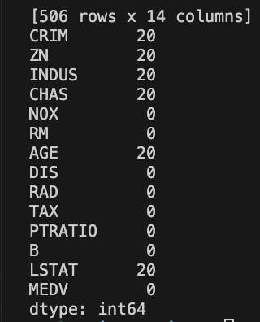
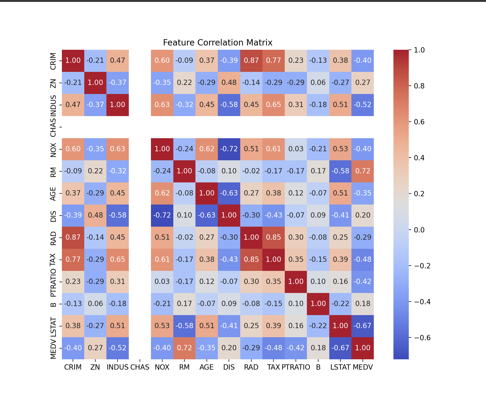
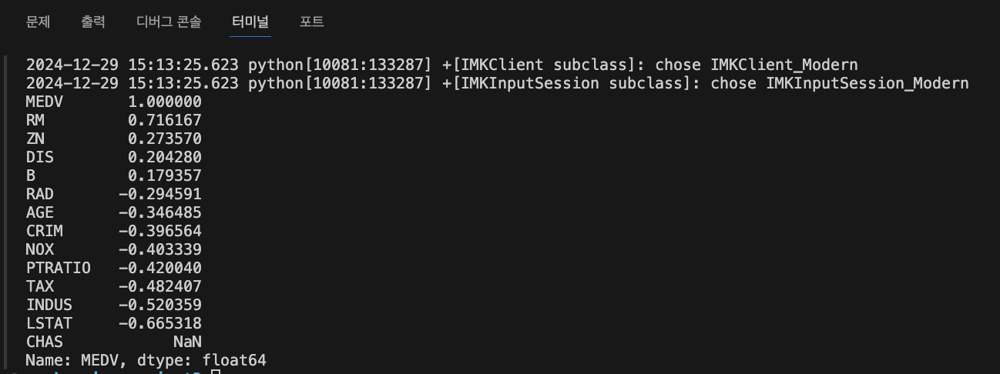
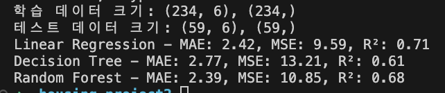
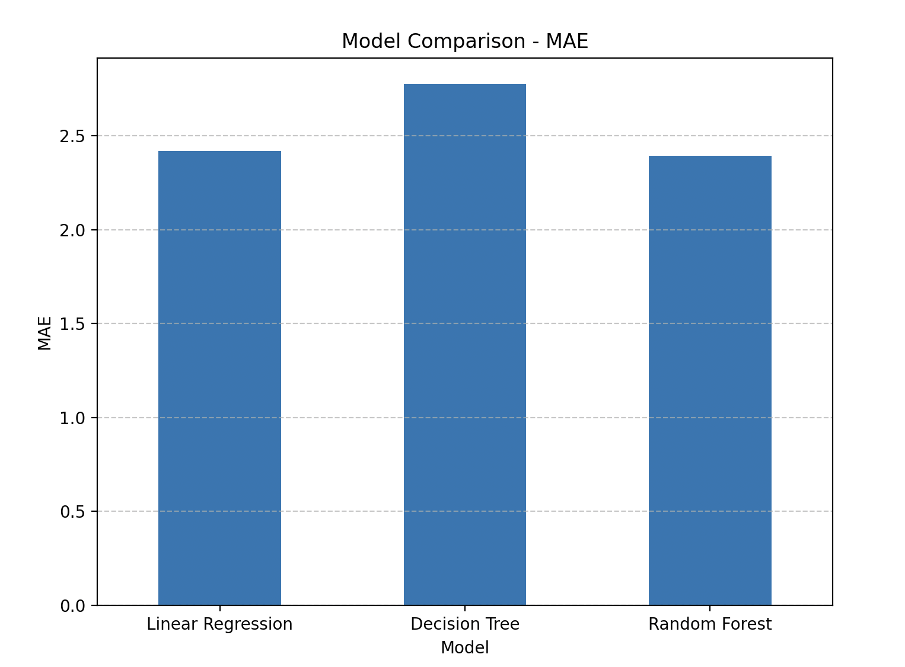
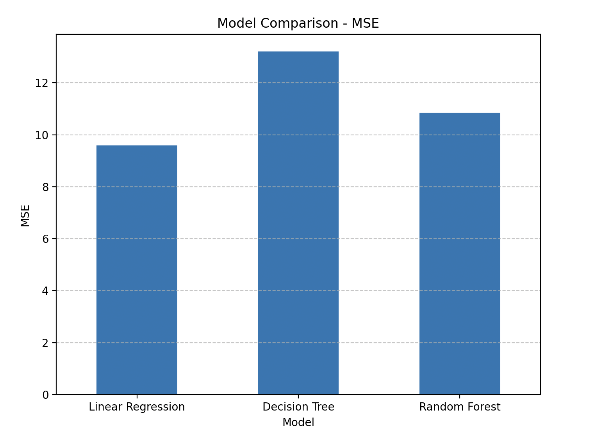
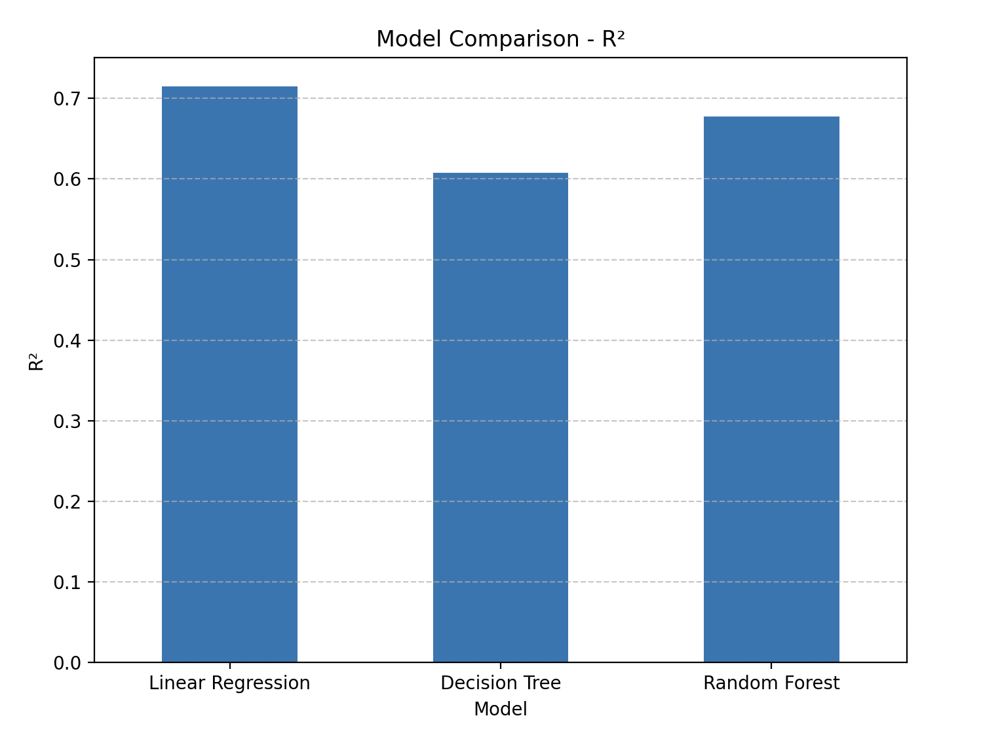
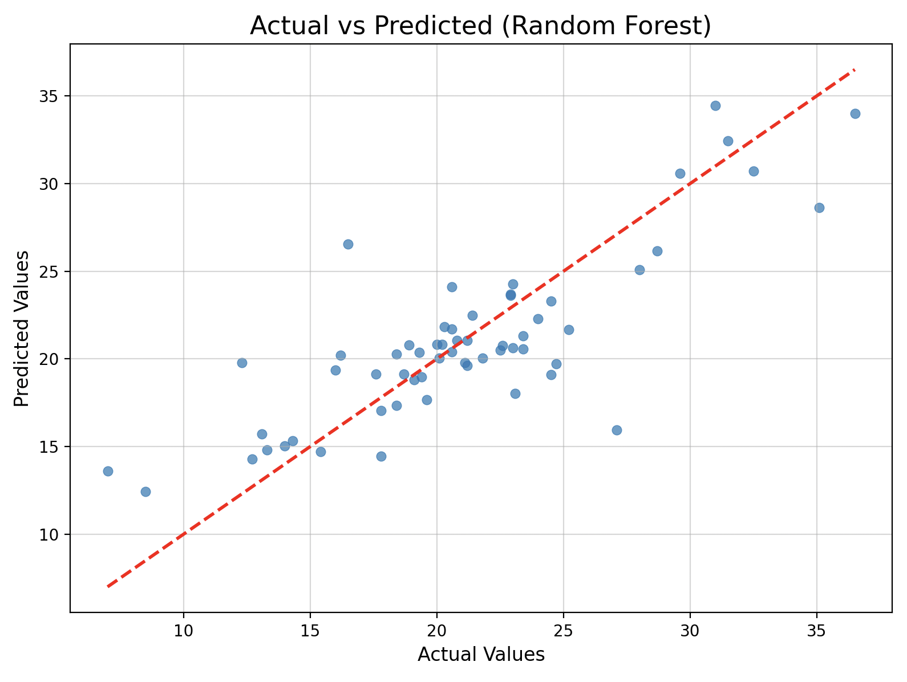

# 결측치 확인 

- 데이터 크기: 506개의 행과 14개의 열이 있다.
CRIM, ZN, INDUS, CHAS, RM, AGE, LSTAT 등 여러 열에 각각 20개의 결측치가 있고,
NOX, DIS, RAD, TAX, PTRATIO, B, MEDV 열은 결측치가 없다.
# 결측치 결정
- 결측치가 전체 데이터의 5~10% 미만일 때 삭제를하고
- 결측치가 비교적 적고, 데이터의 연속적 특징을 유지하고 싶을 때 대체를 하고
- 데이터가 충분히 많고, 예측을 위해 추가적인 연산이 가능할 때 예측을 한다.

# 결측치 삭제
결측치가 5% 미만이므로, 결측치가 포함된 행을 삭제해도 데이터 손실이 크지 않다고 판단하고 결정했다
삭제를 하고 데이터 크기 확인을 했는데 (394, 14) 라고 나왔다.
- 왜 데이터 크기가 더 많이 줄어들었을까?
결측치가 포함된 열이 6개(CRIM, ZN, INDUS, CHAS, RM, LSTAT)이므로, 각 열에서 결측치가 중복된 행에 대해 모두 제거되었기 때문이고
중복으로 결측치가 포함된 행들이 있어, 506개 중 394개만 남은 것으로 보인다.
20개 이하의 데이터 손실이라면 무시할 수 있지만, 현재 약 22%는 비교적 큰 손실이고
삭제로 인해 모델이 학습할 데이터가 줄어들어, 성능 저하로 이어질 가능성이 있다.

# 결측치 대체
**삭제로 인해 데이터 손실이 크므로**, 삭제 하지 않고 평균값 으로 대체로 했다. 

# 이상치 제거 후 데이터 크기: 
(257, 14)
이상치 제거로 인해 많은 행이 삭제되었다. 초기 데이터 크기(506개 행)와 비교해 약 49.2%의 데이터가 제거가 되서,
IQR의 기준을 1.5 대신 더 큰 값(예: 2.0 또는 3.0)으로 설정했다. 이를 통해 극단적인 이상치만 제거하도록 조정할 수 있도록.
이렇게 해서 
이상치 제거 후 데이터 크기: **(293, 14)** 가 되었다.

# 특징 선택
상관관계 히트맵

히트맵은 데이터의 각 특성과 MEDV(주택 가격) 간의 상관관계를 시각적으로 보여주는 그래프 이다.
빨간색 계열: 양의 상관관계 (값이 클수록 MEDV도 커짐).
파란색 계열: 음의 상관관계 (값이 클수록 MEDV는 작아짐).
1. 1순위로 선택할 주요 특성:
- RM (0.72): 강한 양의 상관관계.
- LSTAT (-0.67): 강한 음의 상관관계.
- PTRATIO (-0.42): 중간 정도의 음의 상관관계.
2. 2순위로 선택할 보조 특성:
- TAX (-0.48), INDUS (-0.52), NOX (-0.40): 중간 정도의 음의 상관관계.
- 이 특성들은 MEDV와 어느 정도 영향을 미친다
3. 제외 가능 특성:
- DIS (0.20), ZN (0.27), CHAS: 상관관계가 약하거나 거의 없음.

이 수치는 MEDV와 각 특성이 얼마나 밀접하게 연관되어 있는지를 나타냄
- 1.0: 완전한 양의 상관관계 (특성이 커지면 MEDV도 커짐).
- -1.0: 완전한 음의 상관관계 (특성이 커지면 MEDV는 작아짐).
- 0: 상관관계가 없음.
- CHAS는 상관계수가 계산되지 않았습니다. 이는 값이 이산형(0 또는 1의 더미 변수)이고, 주택 가격과 거의 관련이 없음을 의미함.

**강한 상관관계:**
1. RM (0.716): 주택당 평균 방 개수.
- 방 개수가 많을수록 MEDV가 증가하는 강한 양의 상관관계가 있음.
2. LSTAT (-0.665): 하위 계층 비율.
- 하위 계층 비율이 높을수록 MEDV가 감소하는 강한 음의 상관관계가 있음.

**중간 정도의 상관관계:**
1. PTRATIO (-0.420):학생/교사 비율.                   
- 학생 수가 많거나 교사 수가 적을수록 MEDV가 낮아지는 경향이 있음.
- 이는 학교 교육 환경이 상대적으로 열악할 가능성을 나타냄.
2. TAX (-0.482):재산세율.
- 높은 세율은 MEDV와 음의 상관관계를 보임. (TAX와 MEDV의 음의 상관관계: 재산세율(TAX)이 높아질수록 주택 가격(MEDV)이 낮아지는 경향이 있다는 의미다.)
- 재산세율(TAX)이 높으면 주택 소유주나 구매자에게 경제적 부담이 커짐.
이는 해당 지역에서 주택 구매를 기피하게 만들고, 결과적으로 주택 가격(MEDV)이 하락할 가능성이 있음.
3. INDUS (-0.520):비소매 상업 비율.
- 상업화가 많을수록 MEDV가 낮아지는 경향이 있음.
4. NOX (-0.403):일산화질소 농도.
- 공기 오염도가 높을수록 MEDV가 낮아지는 경향이 있음.

**약한 상관관계:**
1. ZN (0.273):대규모 주거 지역 비율.
- 상관관계가 약하며 MEDV와 연관성이 적음.
2. DIS (0.204):고용 센터와의 거리.
- 거리와 주택 가격 간의 상관관계는 약함.
3. AGE (-0.346):오래된 주택 비율.
- 오래된 주택이 많은 지역은 MEDV가 낮아지는 경향이 있지만, 중간 이하의 상관관계이다.
4. CRIM (-0.396):범죄율.
- 범죄율이 높을수록 MEDV가 낮아지는 경향이 있지만, 상관관계는 강하지 않음.
**주요 특성 선택**
'RM', 'LSTAT', 'PTRATIO', 'TAX', 'INDUS', 'NOX'

# 데이터 분할
80%는 학습 데이터, 20%는 테스트 데이터로 분할함.
1. 전체 데이터 크기: 전체 데이터는 총 293개 행.
2. 학습 데이터 (X_train, y_train):
- 총 234개의 샘플 (80%). 모델 학습에 사용된다.
3. 테스트 데이터 (X_test, y_test): 총 59개의 샘플 (20%). 학습된 모델을 평가하는 데 사용된다.

# 여러 회귀 모델 비교: 선형 회귀/의사결정나무/랜덤 포레스트

 데이터 크기 확인
 - 학습 데이터 크기: (234, 6) → 총 234개의 샘플과 6개의 특성(컬럼).
 - 테스트 데이터 크기: (59, 6) → 총 59개의 샘플과 6개의 특성(컬럼).

 **각 모델의 평가 지표 해석**
 1. **Linear Regression (선형 회귀)**

 MAE (Mean Absolute Error): 2.42
 - 예측값과 실제값 간의 절대 오차 평균이 2.42이다.
 - 오차가 가장 작아, 가장 정확한 모델로 보임.

MSE (Mean Squared Error): 9.59
- 제곱 오차 평균입니다. 낮을수록 예측 정확도가 높다.
- MSE가 가장 낮음.

R² (R-squared): 0.71
- R² 값이 0.71로, 모델이 데이터를 71% 설명할 수 있다는 의미임.

2. **Decision Tree (의사결정나무)**

MAE: 2.77
- 선형 회귀보다 오차가 큼

MSE: 13.21
- 오차 제곱 평균이 선형 회귀보다 큼.

R²: 0.61
- 데이터 설명력이 61%로, 다른 모델보다 낮은 성능을 보임.

3. **Random Forest (랜덤 포레스트)**

MAE: 2.39
- 선형 회귀와 비슷한 수준으로 가장 낮은 오차를 기록.

MSE: 10.85
- 선형 회귀보다 높지만, 의사결정나무보다 낮다

R²: 0.68
- 데이터 설명력이 68%로 선형 회귀보다 약간 낮다.

**결과 분석**
1. **선형 회귀 모델 (Linear Regression)**
- 전반적으로 가장 높은 성능을 보임.
**MAE(2.42)**와 **MSE(9.59)**가 가장 낮아, 예측 정확도가 높고,
R²도 가장 높음(0.71).

2. 랜덤 포레스트 (Random Forest)
- 선형 회귀와 비슷한 성능을 보임. MAE(2.39)는 가장 낮으며, R²(0.68)도 준수함.
다만, **MSE(10.85)**가 선형 회귀보다 약간 높음

3. 의사결정나무 (Decision Tree)
- 세 모델 중 성능이 가장 낮음
오차가 가장 크며(MAE: 2.77, MSE: 13.21), 데이터 설명력도 낮음(R²: 0.61).

# 모델 성능 평가: 지표를 사용하여 모델 성능을 비교

1. **MAE (Mean Absolute Error) 그래프**
- 의미: 예측값과 실제값의 절대 오차의 평균. 값이 작을수록 모델의 예측이 정확함.
- Linear Regression: 약 2.42
- Decision Tree: 약 2.77
- Random Forest: 약 2.39
해석
- 랜덤 포레스트(Random Forest)가 가장 낮은 MAE를 기록, 가장 정확한 모델임.
- 의사결정나무(Decision Tree)는 가장 높은 MAE로 성능이 상대적으로 떨어짐
- 선형 회귀(Linear Regression)는 랜덤 포레스트와 유사한 성능을 보임.

2. **MSE (Mean Squared Error) 그래프**
- 의미: 예측값과 실제값의 제곱 오차의 평균. 값이 작을수록 모델이 정확함. MAE보다 큰 오차에 민감.
- Linear Regression: 약 9.59
- Decision Tree: 약 13.21
- Random Forest: 약 10.85
해석
- 선형 회귀(Linear Regression)가 가장 낮은 MSE를 기록, 큰 오차를 덜 민감하게 다룸.
- 의사결정나무(Decision Tree)는 가장 높은 MSE를 기록, 큰 오차에 취약함.
- 랜덤 포레스트(Random Forest)는 선형 회귀보다는 높지만, 의사결정나무보다는 낮은 MSE를 기록.

3. R² (R-squared) 그래프
- 의미: 모델이 데이터를 얼마나 잘 설명하는지 나타내는 지표. 1에 가까울수록 좋음.
- Linear Regression: 약 0.71
- Decision Tree: 약 0.61
- Random Forest: 약 0.68
해석
- 선형 회귀(Linear Regression)가 가장 높은 R²를 기록, 데이터를 가장 잘 설명함
- 랜덤 포레스트(Random Forest)는 선형 회귀에 근접한 성능을 보임
- 의사결정나무(Decision Tree)는 가장 낮은 R²를 기록, 상대적으로 데이터를 덜 설명함.

**최적모델**
- **랜덤 포레스트(Random Forest)**와 **선형 회귀(Linear Regression)**가 유사한 성능을 보임.
- 그러나 랜덤 포레스트는 MAE에서 더 낮은 값을 기록해, 더 정확한 예측을 제공할 가능성이 높음

**성능이 낮은 모델:**
- **의사결정나무(Decision Tree)**는 모든 지표에서 가장 낮은 성능을 기록

만약 간단하고 해석 가능한 모델을 원한다면 선형 회귀를 사용할 수 있음

# 최적의 모델을 선택하여 결과를 시각화

# 전체 내용 요약**
1.  데이터 전처리
- 결측치 처리: 데이터셋의 일부 열에서 결측치가 발견되었으며, 이를 각 열의 평균값으로 대체하였습니다. 이는 데이터 손실을 최소화하고 모델 학습에 필요한 데이터를 보존하기 위함이었습니다.
- 이상치 탐지 및 제거: IQR(사분위수 범위) 방법을 활용하여 이상치를 탐지하였으며, 데이터의 경계를 적절히 설정하여 극단값을 제거하였습니다. 이 과정에서 데이터 크기가 감소하였지만, 분석 결과에 긍정적인 영향을 미칠 것으로 판단됩니다.
- 특징 선택: 상관분석을 통해 목표 변수인 MEDV(주택 가격)와 상관관계가 높은 변수 6개를 선택하였습니다. 이 과정에서 RM, LSTAT, PTRATIO, TAX, INDUS, NOX가 주요 변수로 선정되었습니다.

2. 모델 비교
- 선형 회귀(Linear Regression): 간단하고 직관적인 모델로서, 예측 성능은 보통 수준이었으며, 다른 모델에 비해 MAE 및 MSE가 약간 높은 편이었습니다.
- 의사결정나무(Decision Tree): 비선형 관계를 잘 처리할 수 있는 모델로, 데이터에 대한 과적합(overfitting) 가능성이 나타났습니다. 결과적으로 다른 모델에 비해 성능이 낮았습니다.
- 랜덤 포레스트(Random Forest):여러 개의 결정 트리를 앙상블하여 안정적이고 높은 성능을 보였습니다. MAE, MSE, R² 모든 지표에서 상대적으로 우수한 결과를 기록하여 최적의 모델로 판단됩니다.

3. 모델 성능 평가
- 랜덤 포레스트가 가장 낮은 MAE와 MSE, 높은 R² 값을 보여주며 가장 우수한 성능을 보였습니다.
- 선형 회귀는 비교적 단순한 데이터 패턴에서 성능이 좋았지만, 복잡한 데이터에는 적합하지 않을 수 있음을 확인하였습니다.
- 의사결정나무는 과적합 문제가 나타났으며, 예측 정확도가 다른 모델에 비해 낮았습니다.

4. 결론
- 랜덤 포레스트(Random Forest) 모델이 선택된 특징과 주어진 데이터에서 가장 우수한 성능을 보였습니다.
따라서, 주택 가격 예측 문제에서는 랜덤 포레스트 모델을 사용하는 것이 가장 적합합니다.